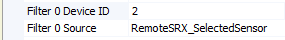
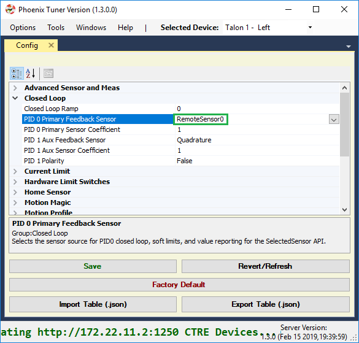
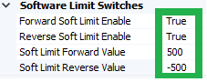

.. _remote-sensors-label:

Bring Up: Remote Sensors
==========================================

This section is dedicated to validating any remote sensor for any CTR motor controller.
Generally using a remote sensor is necessary for:

- Close-Loop control modes (Position, MotionMagic, Velocity, MotionProfile) when the sensor cannot be directly connected to the motor controller
- Soft limits (auto neutral motor if out of range) when the sensor cannot be directly connected to the motor controller
- Auxiliary Closed-Loop control modes (MotionProfileArc, and all other Closed-Loop control modes)

.. note:: If you wish to use Pigeon as a remote sensor over gadgeteer ribbon cable be sure to use Pigeon firmware 4.13 or higher. There is a bug that prevents Pigeon from appearing as a remote sensor in some cases over gadgeteer ribbon cable that has been fixed in 4.13

Bring up the sensor on the other CTRE CAN device
~~~~~~~~~~~~~~~~~~~~~~~~~~~~~~~~~~~~~~~~~~~~~~~~~~~~~~~~~~~~~~~~

In order to use remote sensors, the sensor needs to be brought up by the device that it's connected to.
This is done by following the guide from any of the previous chapters, specifically:

.. toctree::
   :maxdepth: 1

   ch07_InitHardTesting
   ch08_BringUpCAN
   ch09_BringUpPCM
   ch10_BringUpPDP
   ch11_BringUpPigeon
   ch12_BringUpCANifier
   ch13_MC
   ch14_MCSensor

In the case that you are using a remote sensor connected to a motor controller, you must **select** that sensor from the motor controller

Filter configuration
~~~~~~~~~~~~~~~~~~~~~~~~~~~~~~~~~~~~~~~~~~~~~~~~~~~~~~~~~~~~~~~~~

Inside Phoenix Tuner, select the motor controller you wish to use the remote sensor with, and go to the config tab.
Inside the tab, go to the remote sensor portion and expand it, where you will see fiter sources and filter Device IDs.

Select the dropdown for filter source 0, and you will see a list of the possible sources of a remote sensor

Select the option that you wish to use, for the purpose of this example we will select a RemoteSRX_SelectedSensor that has configured a quadrature encoder, but any of these will work.

As well as this, select Filter 0 Device ID and set it to the CAN device ID of the remote sensor. Press save, making sure the text goes from bold to non-bold.

Sensor Check - No Motor Drive
~~~~~~~~~~~~~~~~~~~~~~~~~~~~~~~~~~~~~~~~~~~~~~~~~~~~~~~~~~~~~~~~~~

After having the filter configured, it is important to check that it is behaving properly. Under the closed loop section of the configs, configure PID 0 Primary Feedback Sensor to be Remote Sensor 0 and press save.

And perform a self test to make sure the configuration took place.

.. image:: img/remote-5.png

Move the mechanism and perform self tests to check the remote sensor is configured correctly

.. tip:: If something is not behaving correctly, double check the sensor setup for that device. If the sensor setup behaves correctly, the error is somewhere in the filter configuration

Sensor Check - With Motor Drive
~~~~~~~~~~~~~~~~~~~~~~~~~~~~~~~~~~~~~~~~~~~~~~~~~~~~~~~~~~~~~~~~~

See :ref:`mc-Sensor-Check` for the guide on checking the sensor with motor drive.

Remote Features Check
~~~~~~~~~~~~~~~~~~~~~~~~~~~~~~~~~~~~~~~~~~~~~~~~~~~~~~~~~~~~~~~~~

With the sensor being properly configured, now we can test the remote features.
A simple way of testing this is by configuring soft limits and checking to make sure those soft limits are upheld by the controller

First, we configure the soft limits on the motor controller so that they're enabled and have values for the forward and reverse limits

Then, we drive the motor to one of the limits. 
It will probably overshoot a bit, but the important piece is that the motor controller is neutral'd after hitting the soft limit, which we can check in the self test and looking at the faults.

