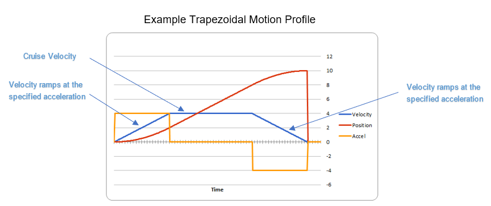
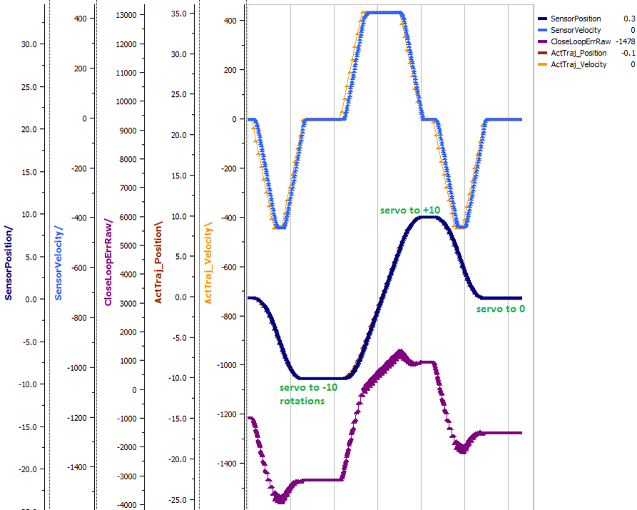
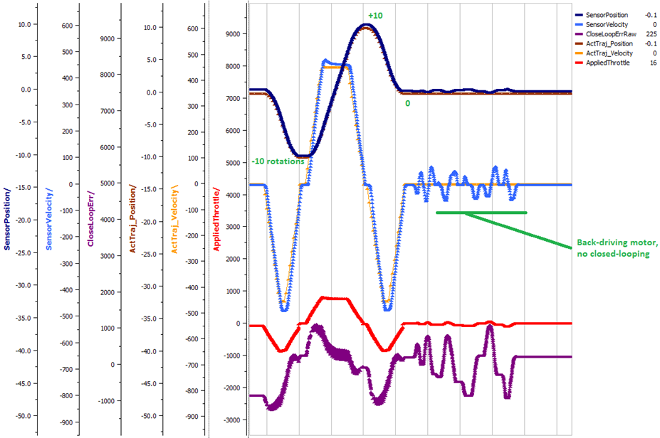
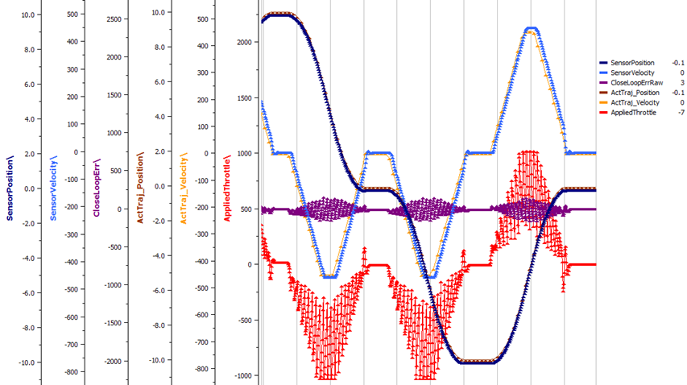
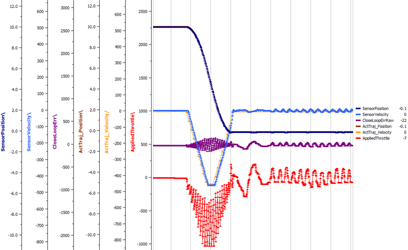
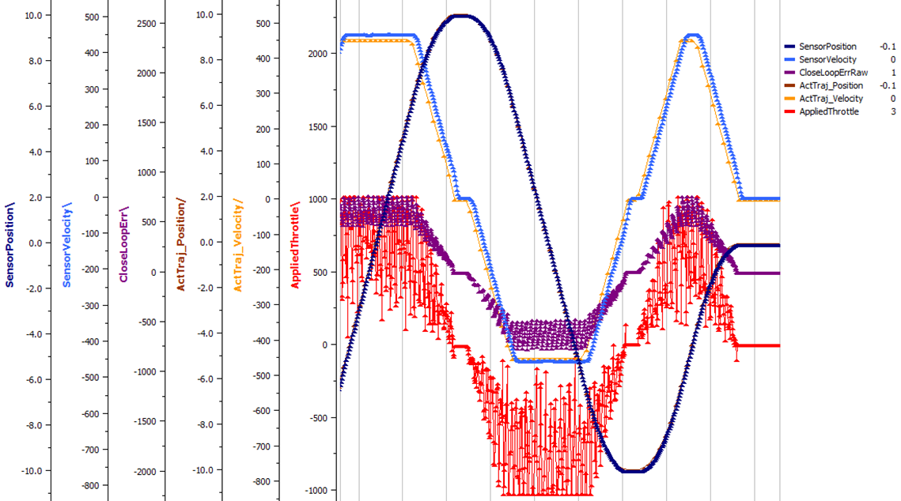
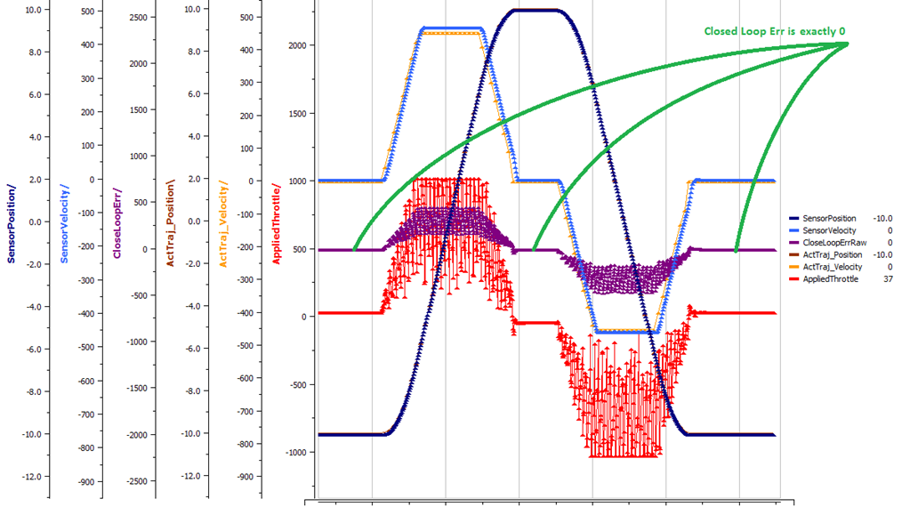
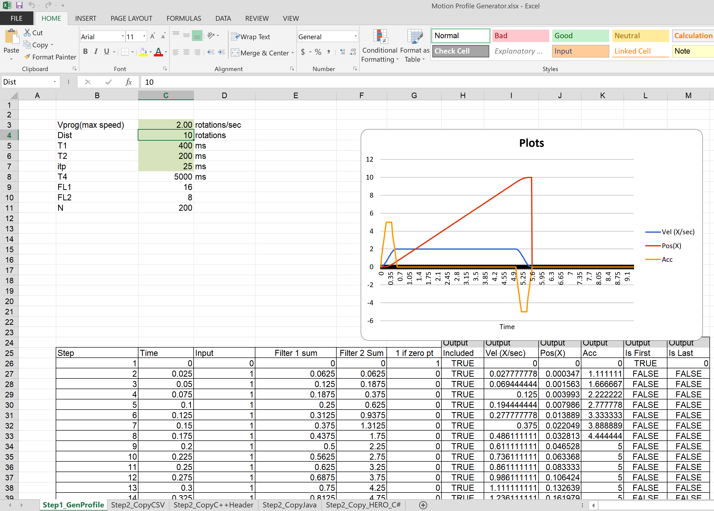
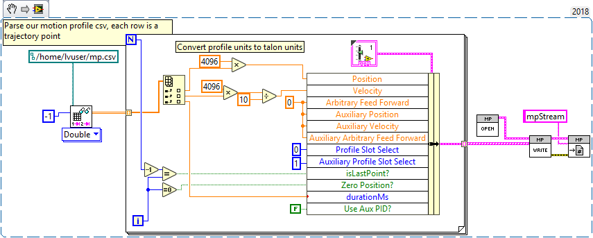

Motor Controller Closed Loop
============================

.. note: Talon SRX and Victor SPX can be used with PWM or CAN bus. However, the features below require CAN bus.

Primer on Closed-loop
~~~~~~~~~~~~~~~~~~~~~~~~~~~~~~~~~~~~~~~~~~~~~~~~~~~~~~~~~~~~~~~~~~~~~~~~~~~~~~~~~~~~~~~~~~~~~~~~~~~~~~~~~~~~~~~~~~~~

Talon SRX and Victor SPX supports are variety of closed-loop modes including position closed-loop, velocity closed-loop, Motion Profiling, and Motion Magic.  Talon SRX additionally supports current closed-loop. 

.. note:: All closed-loop modes update every 1ms (1000Hz) unless configured otherwise.

.. tip:: While tuning the closed-loop, use the Tuner configuration tab to quickly change the gains “on the fly”. Once the PID is stable, set the gain values in code so that Talons can be swapped/replaced easily.  

Regardless of which closed loop control mode, the following statements apply:

- Current limit and voltage compensation selections are honored (just like in open-loop PercentOutput mode)
- “Ramping” can be configured using configClosedloopRamp (routine or VI)
- All other open-loop features are honored during closed loop (neutral mode, peaks, nominal outputs, etc).
- Closed Loop controller will pull closed-loop gain/setting information from a selected slot.  There are four slots to choose from (for gain-scheduling).
- PIDF controller takes in target and sensor position measurements in “raw” sensor units.  This means a CTRE Mag Encoder will count 4096 units per rotation.
- PIDF controller takes in target and sensor velocity measurements in “raw” sensor units per 100ms.  
- PIDF controller calculates the motor output such that, 1023 is interpreted as “full”.  This means a closed loop error of 341 (sensor units) X kP of 3.0 will produce full motor output (1023).

.. note:: A target goal of 2020 is to normalize the PID controller to interpret sensor using normalized units, and adjusting the PID output such that  ‘1’ is interpreted as full.  This will likely be a “back-breaking” change.  This also means 2019 will likely be the last time you see “1023” used anywhere.

Below are descriptions for the various control modes.

Position Closed-Loop Control Mode
----------------------------------------------------------------------------------

The Position Closed-Loop control mode can be used to abruptly servo to and maintain a target position. 

A simple strategy for setting up a closed loop is to zero out all Closed-Loop Control Parameters and start with the Proportional Gain.  

For example if you want your mechanism to drive 50% throttle when the error is 4096 (one rotation when using CTRE Mag Encoder), then the calculated Proportional Gain would be (0.50 X 1023) / 4096 = ~0.125.  

Tune this until the sensed value is close to the target under typical load.  Many prefer to simply double the P-gain until oscillations occur, then reduce accordingly.

If the mechanism accelerates too abruptly, Derivative Gain can be used to smooth the motion.  Typically start with 10x to 100x of your current Proportional Gain.  
If application requires a controlled (smooth) deceleration towards the target, we strongly recommend motion-magic.

If the mechanism never quite reaches the target and increasing Integral Gain is viable, start with 1/100th of the Proportional Gain.

Current Closed-Loop Control Mode
----------------------------------------------------------------------------------
The Talon’s Closed-Loop logic can be used to approach a target current-draw.  Target and sampled current is passed into the PIDF controller in milliamperes.  However the robot API expresses the target current in amperes.

.. note:: Current Control Mode is separate from Current Limit.  

.. tip:: A simple strategy for setting up a current-draw closed loop is to zero out all Closed-Loop Control Parameters and start with the Feed-Forward Gain.  Tune this until the current-draw is close to the target under typical load.  Then start increasing P gain so that the closed-loop will make up for the remaining error.  If necessary, reduce Feed-Forward gain and increase P Gain so that the closed-loop will react more strongly to the ClosedLoopError.

.. warning:: This feature is not available on Victor SPX.

Velocity Closed-Loop Control Mode
----------------------------------------------------------------------------------
The Talon’s Closed-Loop logic can be used to maintain a target velocity.  
Target and sampled velocity is passed into the equation in native sensor units per 100ms.  

.. tip:: A simple strategy for setting up a closed loop is to zero out all Closed-Loop Control Parameters and start with the Feed-Forward Gain.  Tune this until the sensed value is close to the target under typical load.  Then start increasing P gain so that the closed-loop will make up for the remaining error.  If necessary, reduce Feed-Forward gain and increase P Gain so that the closed-loop will react more strongly to the ClosedLoopError.

.. tip:: Velocity Closed-Loop tuning is similar to Current Closed-Loop tuning in their use of feed-forward.  Begin by measuring the sensor velocity while driving the Talon at a large throttle.

 
Motion Magic Control Mode
----------------------------------------------------------------------------------
Motion Magic is a control mode for Talon SRX that provides the benefits of Motion Profiling without needing to generate motion profile trajectory points.  
When using Motion Magic, Talon SRX / Victor SPX will move to a set target position using a Trapezoidal Motion Profile, while honoring the user specified acceleration and maximum velocity (cruise velocity).

The benefits of this control mode over “simple” PID position closed-looping are:

• Control of the mechanism throughout the entire motion (as opposed to racing to the end target position).  
• Control of the mechanism’s inertia to ensure smooth transitions between set points. 
• Improved repeatability despite changes in battery voltage.
• Improved repeatability despite changes in motor load.

After gain/settings are determined, the robot-application only needs to periodically set the target position.  

There is no general requirement to “wait for the profile to finish”, however the robot application can poll the sensor position and determine when the motion is finished if need be.

A Trapezoidal Motion Profile generally ramps the output velocity at a specified acceleration until cruise velocity is reached.  This cruise velocity is then maintained until the system needs to deaccelerate to reach the target position and stop motion.  Talon determines when these critical points occur on-the-fly.   

.. note:: If the remaining sensor distance to travel is small, the velocity may not reach cruise velocity as this would overshoot the target position.  This is often referred to as a “triangle profile”.

Motion Magic utilizes the same PIDF parameters as Motion Profiling.  

Two additional parameters need to be set in the Talon SRX– Acceleration and Cruise Velocity.

The Acceleration parameter controls acceleration and deacceleration rates during the beginning and end of the trapezoidal motion.  The Cruise Velocity parameter controls the cruising velocity of the motion.

Motion Profile Control Mode
----------------------------------------------------------------------------------
Talon SRX and Victor SPX support other closed-loop modes that allow a “Robot Controller” to specify/select a target value to meet.  The target can simply be the percent output motor drive, or a target current-draw.  When used with a feedback sensor, the robot controller may also simply set the target position, or velocity to servo/maintain.   

However, for advanced motion profiling, the Talon SRX / Victor SPX additionally supports a mode whereby the robot controller can *stream* a sequence of trajectory points to express an *entire motion profile*.

Each trajectory point holds the desired velocity, position, arbitrary feedforward, and time duration to honor said point until moving on to the next point.  The point also holds targets for both the primary and auxiliary PID controller, allowing for differential control (drivetrain, differential mechanisms).

Alternatively, the trajectory points can be streamed into the motor controller *as the motor controller is executing the profile*, so long as the robot controller sends the trajectory points faster than the Talon consumes them.  This also means that there is no practical limit to how long a profile can be.

.. tip :: Starting in 2019, the Talon and Victor will linearly interpolate targets between two buffer points every 1ms.  This means you can send points with larger time durations, but still have a smooth continuous motion.  This features default on.

What is the benefit? 
Leveraging the Motion Profile Control Mode in the Talon SRX has the following benefits:

• Direct control of the mechanism throughout the entire motion (as opposed to a single PID closed-loop which directly servos to the end target position). 
• Accurate scheduling of the trajectory points that is not affected by the performance of the primary robot controller.
• Improved repeatability despite changes in battery voltage.
• Improved repeatability despite changes in motor load. 
• Provides a method to synchronously gain-schedule.

Additionally, this mode could be used to schedule several position servos in advance with precise time outs.  For example, one could map out a collection of positions and timeouts, then stream the array to the Talon SRX to execute them.

Auxiliary Closed Loop
----------------------------------------------------------------------------------

Along with all the above control modes, every motor controller has the ability to run a second PID loop, what's called the auxiliary PID loop (PID[1]), and add or subtract it to the primary PID loop (PID[0]).

This is useful as a way to control a differential system. For example, say we want to control the position of a drive train using Position Closed Looping, and we have an encoder on each side.
PID[0] is used to calculate the error in the sum of the sensors from the target position, generating an output that will move the robot closer to the target position.
Meanwhile, PID[1] can be used to calculate the error in the difference of the sensors from 0, generating an output that is used to maintain the robot's heading and prevent it from veering off course.

This can also be expanded to a differential lifting mechanism. Say we have an elevator that is ran off two motors with no mechanical linkage between the sides. 
We can use the sum of the position of either side to control the elevation of the elevator, and the difference of the positions to ensure one side is not far above or below the other.
If we wish, we can even open loop the elevation of the elevator while still maintaining the difference of the elevator by utilizing the arbitrary feed forward term.

.. note:: In order to use Auxiliary Closed Loop, a remote sensor will need to have been configured for PID[0] or PID[1]. Look at :ref:`remote-sensors-label` to see how to do this  

Motion Profile Arc Control Mode
----------------------------------------------------------------------------------

Motion Profile Arc utilizes the Auxiliary Closed Loop features to profile the motion of not just *one* degree of freedom, but of *two*.

In the exmample of trying to profile the movement of the robot on a field, the primary PID can be used to ensure the robot is a specified distance (sum of both sides) away, and at the same time the Auxiliary PID can be used to ensure the robot is facing the right direction (difference of both sides or heading from a pigeon), allowing the robot to follow a spline.

The benefits of this are the same as for the Motion Profile control mode, and at the same time expands on the possibilities this can be used for.

Sensor Preparation
~~~~~~~~~~~~~~~~~~~~~~~~~~~~~~~~~~~~~~~~~~~~~~~~~~~~~~~~~~~~~~~~~~~~~~~~~~~~~~~~~~~~~~~~~~~~~~~~~~~~~~~~~~~~~~~~~~~~

Before invoking any of the closed loop modes, the following must be done:

• Complete the sensor bring up procedure to ensure sensor phase and general health.
• Record the maximum sensor velocity (position units per 100ms) at 100% motor output.
• Calculating kF gain if applicable (Velocity Closed Loop, Motion Profile, Motion Magic).

The first two are covered in section “Confirm Sensor Resolution/Velocity”.
Calculating feed forward is done in the next section.

Calculating Feed Forward gain(kF)
~~~~~~~~~~~~~~~~~~~~~~~~~~~~~~~~~~~~~~~~~~~~~~~~~~~~~~~~~~~~~~~~~~~~~~~~~~~~~~~~~~~~~~~~~~~~~~~~~~~~~~~~~~~~~~~~~~~~
A typical strategy for estimating the necessary motor output is to take the target velocity and multiplying by a tuned/calculated scalar.
More advanced feed forward methods (gravity compensation, velocity and acceleration feed forwards, static offsets, etc) can be done with the arbitrary feed forward features.

Do I need to calculate kF?
----------------------------------------------------------------------------------
If using any of the control modes, we recommend calculating the kF:

- Velocity Closed Loop: kF is multiplied by target velocity and added to output.
- Current (Draw) Closed Loop: kF is multiplied by the target current-draw and added to output.
- MotionMagic/ MotionProfile / MotionProfileArc: kF is multiplied by the runtime-calculated target and added to output.

.. note:: Most control modes also provide an “arbitrary feed forward” term that user can provide during the runtime.  This allows for complete custom implementation of feedforward beyond the simple kF X target.  Implementing kS, kV,kA terms can be done this way.

.. note:: When using position closed loop, it is generally desired to use a kF of ‘0’.  During this mode target position is multiplied by  kF and added to motor output.  If providing a feedforward is necessary, we recommend using the arbitrary feed forward term (4 param Set) to better implement this.

How to calculate kF
----------------------------------------------------------------------------------
Using Tuner (Self-Test or Plotter), we’ve measured a peak velocity of **9326** native units per 100ms at 100% output.  This can also be retrieved using getSelectedSensorVelocity (routine or VI).

Now let’s calculate a Feed-forward gain so that 100% motor output is calculated when the requested speed is **9326** native units per 100ms.

F-gain = (100% X 1023) / **9326**
F-gain = 0.1097

Let’s check our math, if the target speed is **9326** native units per 100ms, Closed-loop output will be (0.1097 X **9326**) => 1023 (full forward).

..note the output of the PIDF engine in Talon/Victor uses 1023 as the “full output.  However the 2020 software release will likely normalize this so that a value of ‘1’ yields “full output.”  This is 

Motion Magic / Position / Velocity / Current Closed Loop Closed Loop
~~~~~~~~~~~~~~~~~~~~~~~~~~~~~~~~~~~~~~~~~~~~~~~~~~~~~~~~~~~~~~~~~~~~~~~~~~~~~~~~~~~~~~~~~~~~~~~~~~~~~~~~~~~~~~~~~~~~

Closed-looping the position/velocity value of a sensor is explained in this section.  
This section also applies to the current (draw) closed loop mode.

Relevant source examples can be found at:

- https://github.com/CrossTheRoadElec/Phoenix-Examples-Languages
- https://github.com/CrossTheRoadElec/Phoenix-Examples-LabVIEW

The general steps are:

- Selecting the sensor type (see previous Bring-Up sections)
- Confirm motor and sensor health (see previous Bring-Up section on sensor)
- Confirm sensor phase (see previous Bring-Up sections)
- Collect max sensor velocity information (see calculating kF section)
- Bring up plotting interface so you can visually see sensor position and motor output.  This can be done via Tuner Plotter, or through LabVIEW/SmartDash/API plotting.
- Configure gains and closed-loop centric configs.

.. note :: if you are using current closed-loop, than a sensor is not necessary

.. note :: Current closed loop is not available on Victor SPX, it is only available on Talon SRX.

Once these previous checks are done, continue down to the gain instructions.

.. note:: This assumes all previous steps have been followed correctly.

1. Checkout the relevant example from CTREs GitHub.

2. Set all of your gains to zero.  Use either API or Phoenix Tuner.

3. If not using Position-Closed loop mode, set the kF to your calculated value.

4. If using Motion Magic, set your initial cruise velocity and acceleration.

The recommended way to do this is to take your max sensor velocity (previous section).

Suppose your kMaxSensorVelocity is **9326** units per 100ms.  A reasonable initial cruise velocity may be half of this velocity, which is **4663**.

Config **4663** to be the cruiseVelocity via configMotionCruiseVelocity routine/VI.

Next lets set the acceleration, which is in velocity units per second (where velocity units = change in sensor per 100ms).  This means that if we choose the same value of **4663** for our acceleration, than Motion Magic will ensure it takes one full second to reach peak cruise velocity.

In short set the acceleration to be the same **4663** value via configMotionAcceleration routine/VI. 

Later you can increase these values based on the application requirements.

5. Deploy the application and use the joystick to adjust your target.  Normally this requires holding down a button on the gamepad (to enter closed loop mode).

Plot the sensor-position to access how well it is tracking.

In this example the mechanism is the left-side of a robot’s drivetrain.  
The robot is elevated such that the wheels spin free.  
In the capture below we see the sensor position/velocity (blue) and the Active Trajectory position/velocity (brown/orange).  
At the end of the movement the closed-loop error (which is in raw units) is sitting at ~1400.units.  
Given the resolution of the sensor this is approximately 0.34 rotations (4096 units per rotation).  
Another note is that when the movement is finished, you can freely back-drive the mechanism without motor-response (because PID gains are zero).

Dialing kP
----------------------------------------------------------------------------------

Next we will add in P-gain so that the closed-loop can react to error.  In the previous section, after running the mechanism with just F-gain, the servo appears to settle with an error or ~1400.

Given an error of (~1400.), suppose we want to respond with another 10% of throttle.  Then our starting kP would be….

(10% X 1023) / (1400) = 0.0731
Now let’s check our math, if the Talon SRX sees an error of 1400 the P-term will be
1400 X 0.0731= 102 (which is about 10% of 1023)
kP = 0.0731

 Apply the P -gain programmatically using your preferred method.  Now retest to see how well the closed-loop responds to varying loads.  

 
Retest the maneuver by holding button 1 and sweeping the gamepad stick.
At the end of this capture, the wheels were hand-spun to demonstrate how aggressive the position servo responds.
Because the wheel still back-drives considerably before motor holds position, the P-gain still needs to be increased.

Double the P-gain until the system oscillates (by a small amount) or until the system responds adequately.

After a few rounds the P gain is at 0.6.

Scope captures below show the sensor position and target position follows visually, but back-driving the motor still shows a minimal motor response.

After several rounds, we’ve landed on a P gain value of 3.  The mechanism overshoots a bit at the end of the maneuver.  Additionally, back-driving the wheel is very difficult as the motor-response is immediate (good).

Once settles, the motor is back-driven to assess how firm the motor holds position.

The wheel is held by the motor firmly.

Dialing kD
----------------------------------------------------------------------------------

To resolve the overshoot at the end of the maneuver, D-gain is added.  D-gain can start typically at 10 X P-gain.

With this change the visual overshoot of the wheel is gone.  The plots also reveal reduced overshoot at the end of the maneuver.

Dialing kI
----------------------------------------------------------------------------------

Typically, the final step is to confirm the sensor settles very close to the target position.  If the final closed-loop error is not quite close enough to zero, consider adding I-gain and I-zone to ensure the Closed-Loop Error ultimately lands at zero (or close enough).  

In testing the closed-loop error settles around 20 units, so we’ll set the Izone to 50 units (large enough to cover the typical error), and start the I-gain at something small (0.001).

Keep doubling I-gain until the error reliably settles to zero.

With some tweaking, we find an I-gain that ensures maneuver settles with an error of 0.

If using Motion Magic, the acceleration and cruise-velocity can be modified to hasten/dampen the maneuver as the application requires.

^^^^^^^^^^^^^^^^^^^^^^^^^^^^^^^^^^^^^^^^^^^^^^^^^^^^^^^^^^^^^^^^^

Motion Profiling Closed Loop
~~~~~~~~~~~~~~~~~~~~~~~~~~~~~~~~~~~~~~~~~~~~~~~~~~~~~~~~~~~~~~~~~~~~~~~~~~~~~~~~~~~~~~~~~~~~~~~~~~~~~~~~~~~~~~~~~~~~

The above guide shows how to dial PID gains for all closed looping, this guide will talk about how to utilize Motion Profiling using a BufferedStream object.

.. note:: It is strongly recommended to use the MotionProfiling example first to become familiar with Motion Profiling, and only after having used the example should you try to implement it in your own robot code

.. tip:: The Buffered stream object is a new object introduced in 2019 designed to make motion profiling easier than ever. The legacy API and the examples that use it are still available.

Create a motion profile
----------------------------------------------------------------------------------

Using Excel or a path generating program, you need to create a series of points that specify the target position, velocity, and the time to the next point.
If you are using an example, there is an excel sheet inside the example folder that does this for you named *Motion Profile Generator*. 
Use this to get started on creating motion profiles.

Upload it to the robot
----------------------------------------------------------------------------------

This can be done either by copy-pasting all the points into the robot application as an array or by copy-pasting the file onto the Robot Controller and using a File operation to read it.
The Java/C++ examples show copy-pasting the points into an array, and the excel document we provide has a page that automtically generates the array for you to copy paste.

.. code-block:: java

	public static double [][]Points = new double[][]{		
		{0,	0	,25},
		{0.000347222222222222,	1.666666667	,25},
		{0.0015625,	4.166666667	,25},
		{0.00399305555555556,	7.5	,25},
		.
		.
		.
		{9.99756944444445,	5	,25},
		{9.99913194444445,	2.5	,25},
		{9.99982638888889,	0.833333333	,25},
		{10,	0	,25}
	};

LabVIEW, on the other hand, uses the file operations to read a csv file and feed the points read from it into an array.

.. tip:: Drag and drop the image above into your Begin.vi block diagram

.. note:: The above image also has the next step, *Write the points to a Buffered Stream* included in it

Write the points to a Buffered Stream
----------------------------------------------------------------------------------

Now you need to write all the points onto a buffered stream object. This is done by calling the *Write* method and passing a trajectory point that has the specified position and velocity into the object.
Be sure that the first point has zeroPos set to true if you wish to zero the position at the start of the profile and that the last point has isLast set to true so the profile recognizes when it's done.

Java example:

.. sphynx note: the comments are not arranged perfecty due to tabs=8 on RTD while VSCode uses tabs=4

.. code-block:: java

	/* Insert every point into buffer, no limit on size */
	for (int i = 0; i < totalCnt; ++i) {

		double direction = forward ? +1 : -1;
		double positionRot = profile[i][0];
		double velocityRPM = profile[i][1];
		int durationMilliseconds = (int) profile[i][2];

		/* for each point, fill our structure and pass it to API */
		point.timeDur = durationMilliseconds;
		point.position = direction * positionRot * Constants.kSensorUnitsPerRotation; 		// Convert Revolutions to Units
		point.velocity = direction * velocityRPM * Constants.kSensorUnitsPerRotation / 600.0;   // Convert RPM to Units/100ms
		point.auxiliaryPos = 0;
		point.auxiliaryVel = 0;
		point.profileSlotSelect0 = Constants.kPrimaryPIDSlot; /* which set of gains would you like to use [0,3]? */
		point.profileSlotSelect1 = 0; /* auxiliary PID [0,1], leave zero */
		point.zeroPos = (i == 0); /* set this to true on the first point */
		point.isLastPoint = ((i + 1) == totalCnt); /* set this to true on the last point */
		point.arbFeedFwd = 0; /* you can add a constant offset to add to PID[0] output here */

		_bufferedStream.Write(point);
	}

Call startMotionProfile
----------------------------------------------------------------------------------

With the Buffered Stream object fully written to, call startMotionProfile and the motor controller will begin executing once the specified number of points have been buffered into it.
Do **not** call *Set* after this, the motor controller will execute on its own.

.. note:: Ensure MotorSafety is **Disabled**. Using the new API with MotorSafety enabled causes undefined behavior. If you wish to use MotorSafety with motion profiling, use the Legacy API.

Check isMotionProfileFinished
----------------------------------------------------------------------------------

After having started the motion profile, you should check when the profile is done by polling *IsMotionProfileFinished* until it returns true.
Once it is true, you know the profile has reached its last point and is complete, so you can move on to the next action.

.. code-block:: java

	if (_master.isMotionProfileFinished()) {
		Instrum.printLine("MP finished");
	}

Mechanism is Finished Command
~~~~~~~~~~~~~~~~~~~~~~~~~~~~~~~~~~~~~~~~~~~~~~~~~~~~~~~~~~~~~~~~~~~~~~~~~~~~~~~~~~~~~~~~~~~~~~~~~~~~~~~~~~~~~~~~~~~~

Sometimes you want to move a mechanism to a setpoint and ensure that it settles before moving on to the next command.
This problem is very mechanism-specific and dependent on what you consider *settling*.
However, the methods provided in Phoenix API allow the user to determine when a mechanism has settled on their own.

The general idea is to specify a threshold the closed loop error has to be within, and keep track of how long the mechanism is within that threshold.
Once the mechanism is within that threshold for a certain period of time, it can be considered finished.

This prevents erroneous *isFinished* methods being tripped, as the mechanism can't momentarily be within the threshold for it to trip, it has to be within the threshold for a meaningful amount of time.

An example of this is shown below in Java, within a class that implements the Command interface

.. code-block:: java

	int loopsToSettle = 10;
	int threshold = 10;
	TalonSRX talon; // !< Replace this with the talon you are using 

	int withinThresholdLoops = 0;

	boolean finished = false;

	// Called repeatedly when this Command is scheduled to run
	@Override
	protected void execute() {
		/* Check if closed loop error is within the threshld */
		if(talon.getClosedLoopError() < threshold && talon.getClosedLoopError() > -threshold)
		{
			withinThresholdLoops++;
		}
		else
		{
			withinThresholdLoops = 0;
		}

		if(withinThresholdLoops > loopsToSettle)
		{
			finished = true;
		}
		else
		{
			finished = false;
		}
	}

	// Make this return true when this Command no longer needs to run execute()
	@Override
	protected boolean isFinished() {
		return finished;
	}

Closed-Loop Configurations
~~~~~~~~~~~~~~~~~~~~~~~~~~~~~~~~~~~~~~~~~~~~~~~~~~~~~~~~~~~~~~~~~~~~~~~~~~~~~~~~~~~~~~~~~~~~~~~~~~~~~~~~~~~~~~~~~~~~
The remaining closed-loop centric configs are listed below.  

General Closed-Loop Configs
----------------------------------------------------------------------------------
+----------------------------------------+------------------------------------------------------------------------+
|                Name                    |                         Description                                    |
+----------------------------------------+------------------------------------------------------------------------+
| PID 0 Primary Feedback Sensor          |  | Selects the sensor source for PID0 closed loop, soft limits, and    |
|                                        |  | value reporting for the SelectedSensor API.                         |
+----------------------------------------+------------------------------------------------------------------------+
| PID 0 Primary Sensor Coefficient       |  | Scalar (0,1] to multiply selected sensor value before using.        |
|                                        |  | Note this will reduce resolution of the closed-loop.                |
+----------------------------------------+------------------------------------------------------------------------+
| PID 1 Aux Feedback Sensor              |  Select the sensor to use for Aux PID[1].                              |
+----------------------------------------+------------------------------------------------------------------------+
| PID 1 Aux Sensor Coefficient           |  | Scalar (0,1] to multiply selected sensor value before using.        |
|                                        |  | Note that this will reduce the resolution of the closed-loop.       |
+----------------------------------------+------------------------------------------------------------------------+
| PID 1 Polarity                         |  | False: motor output = PID[0] + PID[1],  follower = PID[0] - PID[1]. |
|                                        |  | True : motor output = PID[0] - PID[1],  follower = PID[0] + PID[1]. |
|                                        |  | This only occurs if follower is an auxiliary type.                  |
+----------------------------------------+------------------------------------------------------------------------+
| Closed Loop Ramp                       |  | How much ramping to apply in seconds from neutral-to-full.          |
|                                        |  | A value of 0.100 means 100ms from neutral to full output.           |
|                                        |  | Set to 0 to disable.                                                |
|                                        |  | Max value is 10 seconds.                                            |
+----------------------------------------+------------------------------------------------------------------------+

Closed-Loop configs per slot (four slots available)
----------------------------------------------------------------------------------
=======================================     =========================================================================================================================================================================================================================================================================================================================  
Name										Description							
=======================================     =========================================================================================================================================================================================================================================================================================================================  
kF 											Feed Fwd gain for Closed loop.  
											See documentation for calculation details.  
											If using velocity, motion magic, or motion profile, 
											use (1023 * duty-cycle / sensor-velocity-sensor-units-per-100ms)
kP 											Proportional gain for closed loop.  This is multiplied by closed loop error in sensor units.  Note the closed loop output interprets a final value of 1023 as full output.  So use a gain of '0.25' to get full output if err is 4096u (Mag Encoder 1 rotation)
kI 											Integral gain for closed loop.  This is multiplied by closed loop error in sensor units every PID Loop.  Note the closed loop output interprets a final value of 1023 as full output.  So use a gain of '0.00025' to get full output if err is 4096u (Mag Encoder 1 rotation) after 1000 loops
kD 											Derivative gain for closed loop.  This is multiplied by derivative error (sensor units per PID loop).  Note the closed loop output interprets a final value of 1023 as full output.  So use a gain of '250' to get full output if derr is 4096u per  (Mag Encoder 1 rotation) per 1000 loops (typ 1 sec)
Loop Period Ms 								Number of milliseconds per PID loop.  Typically, this is 1ms.
Allowable Error 							If the closed loop error is within this threshold, the motor output will be neutral.  Set to 0 to disable.  Value is in sensor units.
I Zone 										Integral Zone can be used to auto clear the integral accumulator if the sensor pos is too far from the target.  This prevent unstable oscillation if the kI is too large.  Value is in sensor units.
Max Integral Accum 							Cap on the integral accumulator in sensor units.  Note accumulator is multiplied by kI AFTER this cap takes effect.
Peak Output 								Absolute max motor output during closed-loop control modes only.  A value of '1' represents full output in both directions.
=======================================     =========================================================================================================================================================================================================================================================================================================================  

Motion Magic Closed-Loop Configs
----------------------------------------------------------------------------------
=======================================     =========================================================================================================================================================================================================================================================================================================================  
Name										Description							
=======================================     =========================================================================================================================================================================================================================================================================================================================  
Acceleration								Motion Magic target acceleration in (sensor units per 100ms) per second.
Cruise Velocity                   			Motion Magic maximum target velocity in sensor units per 100ms.
=======================================     =========================================================================================================================================================================================================================================================================================================================  

Motion Profile Configs
----------------------------------------------------------------------------------
+----------------------------------------+------------------------------------------------------------------------+
|                Name                    |                         Description                                    |
+----------------------------------------+------------------------------------------------------------------------+
| Base Trajectory Period                 | | Base value (ms) ADDED to every buffered trajectory point.            |
|                                        | | Note that each trajectory point has an individual duration (0-127ms).|
|                                        | | This can be used to uniformly delay every point.                     |
+----------------------------------------+------------------------------------------------------------------------+
| Trajectory Interpolation Enable        | | Set to true so Motion Profile Executor to linearize the target       |
|                                        | | position and velocity every 1ms. Set to false to match 2018 season   |
|                                        | | behavior (no linearization). This feature allows sending less        |
|                                        | | points over time and still having resolute control                   |
|                                        | | Default is set to true.                                              |
+----------------------------------------+------------------------------------------------------------------------+
